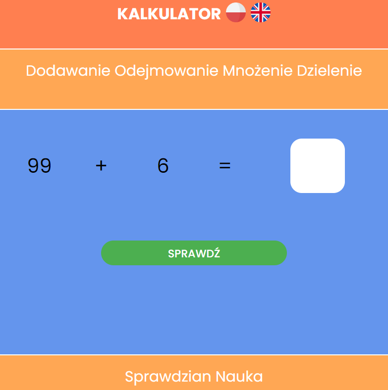

# Math learning site🚀

This page is designed to teach addition, subtraction, multiplication and division. 

## Installation

To run this project you need XAMPP or similar web server software. Now I will show you how to run a project locally using XAMPP. If  you don't have XAMPP you download it from official website [here](https://www.apachefriends.org/download.html).

- Open the location where you installed XAMPP
- Download all project files
- Place the files in htdocs folder
- Run XAMPP and start Apache and MySQL module
- Click on admin on both module
- Look up for import in phpmyadmin
- Select kalkulator.sql and then execute

If everything is setup properly you should end up with fully working website.
    
## Usage/Examples

 The site is designed to teach mathematics, there is a random mode, i.e. infinite tasks, and a test mode where the user has ten randomly generated tasks. The result from the test can then be sent to a simple database.
## Screenshots

## Features
- English & Polish support
- Website is fully resizable

