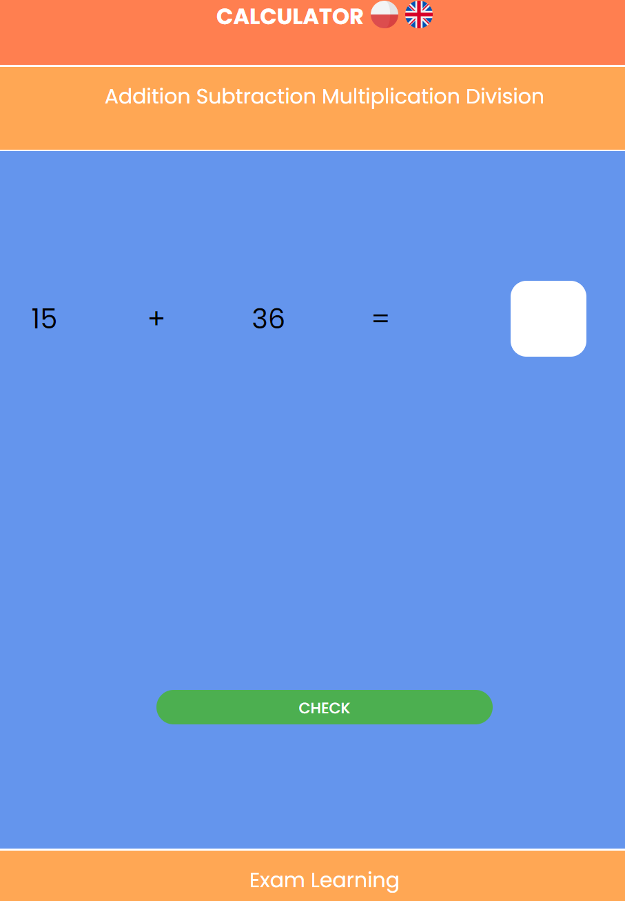

  

###

<h1 align="center">MATH LEARNING SITE | CALCULATOR</h1>

###

This page is designed to teach addition, subtraction, multiplication and division.

###

<h3 align="left">✨About the project:</h3>

###

📌 The site is designed to teach mathematics, there is a random mode, i.e. infinite tasks, and a test mode where the user has ten randomly generated tasks. The result from the test can then be sent to a simple database,  📌Website is mobile friendly,   📌Website supports two languages: Polish and English

###

<h3 align="left">✨Screenshots:</h3>

###

  
  

###

<h3 align="left">✨Instruction of usage(XAMPP): 📌Download files 📌Put files into htdocs folder 📌Start apache and mysql 📌Click on admin on both module 📌Look up for import in phpmyadmin 📌Select kalkulator.sql and then execute 📌If everything is setup properly you should end up with fully working website</h3>

###

###

  
  
  
  
  
  
  

###

###
